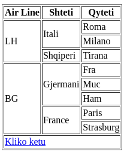
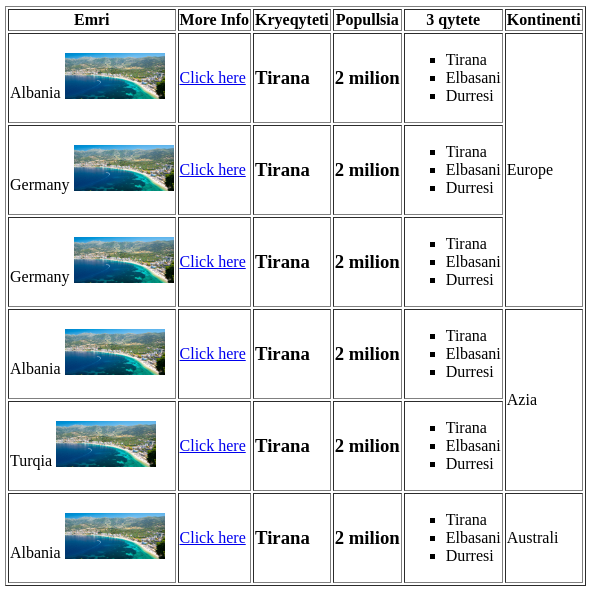
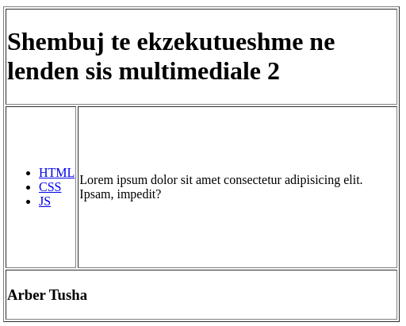

# Ushtrime

Ushtrime per sisteme multimediale per HTML, CSS dhe JS

## Usht 1

Krijoni nje faqe html qe ka ne permbajtje te saj nje paragraph me tekstin: `Meposhte do te gjeni nje permbledhje te karakteristikave te laptopit HP`. Duhet te krijoni:

- Shfaq nje imazh te klikueshem ne hover te te cilit te shfaqet mesazhi "Laptop HP"

- Ne klikim te imazhit te hapet ne nje faqe tjeter karaktreistikat e plota per kete lapotp. Faqja e re shfaq nje paragraf qe ka keto te dhena:

  - Madhesia Ram: 16GB
  - Procesor: Intel Core Gjenerata 11
  - Tipi sistemit: 64 bit
  - Sistem operimi: Windows

## Usht 2

Krijoni nje faqe HTML qe liston produktet qe shiten ne nje market duke vendosur nje pershkrim te shkurter qe thekson `cmimin`, `emrin e produktit` dhe `kategorine` e tij.

- Cdo produkti te shoqerohet me nje vije ndarese nga produktet e tjera.
- Vendosni nje `reference` per te marre me shume detaje rreth tij.
- Shfaqni `cmimin` qe ka qne me vije ne mes dhe cmimin e ri me bold.

## Usht 3

Krijoni nje faqe HTML titulli i te ciles eshte `REFERENCA` e cila jep nje pershkrim te temave qe kursi Sisteme Multimediale mbulon. Brenda faqes HTML vendosni dy links.

- Linku i pare, ne momentin qe klikohet duhet qe te pozicionohemi ne fund te pershkrimit te kurrikules.

- Linku i dyte, kur klikohet duhet te na pozicionoje ne fillim te pershkrimit

## Usht 4

Krijo ne HTML nje tabele te kesaj forme

## Usht 6

Krijo nje faqe html mbi te dhenat e 5 shtete te boptes.

- Ne kolonen 1 te vendoset `emri i shtetit` dhe nje `imazh` i atij shteti.
- Ne kolonen 2 nje `link` qe hap ne nje tab te ri info per kete shtet.
- Ne kolonen 3 te shfaqet `kryeqyteti` i ketij shteti
- Ne kolonen 4 te shfaqet `numri i popullsise`
- Ne kolonen 5 te shfaqen me `simbole katrore` 3 qytetet me te populluara te secilit shtet
- Ne kolonen e 6 te shfaqet kontineni ku ky shtet ben pjese, qe mund te shtrihet ne disa rrehta.

Tabela duhet ti ngjasoje kesaj fotoje:

## Usht 7

Krijo nje `liste te renditur` me filmat e tu te preferuar. Per cdo film duhet te tregosh brenda nje `liste jo te renditur` emrat e aktoreve kryesore. Lista duhet te kete kete pamje

1. Harry Potter
   - Daniel Radcliffe
   - Emma Watson
   - Rupert Grint
2. Interstellar
   - Matthew McConaughey
   - Jessica Chastain
   - Anne Hathaway

## Usht 8

Krijo nje table me 3 reshat dhe 2 shtlla. Tabela duhe te jete `500px` e gjere. Qelizat e tabeles duhet te jene te formatara keshtu:

- Qeliza e reshtit te pare te shtrihet ne `2 kolona` dhe te kete si permbajtje nje `titull kryesor`. Permbajtja duhet te jete `"Shembuj te ekzekutueshme ne lenden sis multimediale"`.

- Qelisa e pare e rreshtit te dyte te kete gjeresi `100px` dhe te permbaje 3 links qe te cojne ne 3 kurset e nndryshme `HTML`, `CSS` dhe `JS`.

- Qeilzza e dyte e rreshtit te dyte te kete lartesi `200px` dhe gjeresi `400px` dhe te kete brend saj nje paragraf.

- Qeliza e reshtit te trete te shtrihet ne `2 kolona` dhe te kete brenda `emirn` dhe `mbimrin` tuaj.

Tabela duhe te kete kete pamje ne fund

## Usht 9

Krijoni nje website, ku te perdorni sa me shume `Semantic tags`. Duhet te krijoni keto gjera:

- Ne kryje te websiteit krijoni nje `header` qe do te permbaje nje `foto tuajen`, `emrin tuaj` dhe nje `pershkrim`.

- Me poshte do te krijoni nje seksion qe do te na ndohmoje per `lundrimin` ne faqe. Duhet te krijoni nje `liste jo te renditur` per 4 seksionet e websiteit.

- ### Section 1:
- Krjoni nje tabele me `4 kolona`.

  - **Kolona 1**: Periudha kur keni kryer nje kurs. Mund te shtrihet ne me shume se 1 rresht
  - **Kolona 2**: Permban llojin e certifikates qe keni marre nga kursi
  - **Kolona 3**: Permban Institucionin qe e ka leshuar kete certifikate.
  - **Kolona 4**: Permban Imazhin e institucionit

- ### Section 2:
- Krijoni nje `liste jo te renditur` me hobit tuaj. Ne fund te cdo elementi te listes te vendosni nje `link` qe te con ne nje faqe tjter per te marre me shume informacion. `Pikat indikuese` te listes duhet te jene ne formen e `rratheve te zbrazur`.

- ### Section 3:
- Krijo nje `liste te renditur` qe permban `Technical Skills` dhe `Soft Skills` per ju. Brenda tyre vendosni nje `liste jo te renditur` per te listuar disa aftesi per secilen kategori.

- ### Section 4:
- Krijo nje `tabele` per te treguar gjuhet qe ju flisni.

  - **Kolona 1** Gjuha qe flisni
  - **Kolona 2** Leximi
  - **Kolona 3** Shkrimi
  - **Kolona 4** Degjimi

- Ne fund te faqes vendosni nje `footer` ku te perfshini vtin e krijimit te ketij website-i.

## Usht 10

Nje student deshiron te aplikoje ne nje kompeticion. Ju duhet te ndertoni nje forme qe ti kerkoni studentit keto te dhena:

- emri
- mbiemri
- username
- email
- password
- address
- city (duke perdorur nje `dropdown`)
- zip code (nje fushe e tipit `number`)
- gjinia (duke perdorur `radio buttons`)
- gjuhet qe flet (duke perdorur `checkboxes`)
- daten e takimit
- nje seksion pershkrues
- submit button

## Usht 11

Krijo nje website qe mban listen e produkteve elektronike tw nje dyqani. Per cdo produkt duhet te shfaqet: nje `imazh`, `emri`, `cmimi`, `gjendja e produktit` dhe nje `link`, qe kur klikohet te hapet pershkrimi i detajuar.

Faqja e datajuar e cdo produkti duhet te permbaje

- Emrin e produktit
- Imazhin e tij
- Pershkrimin
- Nje forme ku te zgjedhesh:
  - Ngjyren nga nje liste me ngjyra
  - Sasine
  - Sasine e RAM (duke perdorur `dropdown`)
  - Gjendjen (Nese ska stok, shfaqet nje tekst `i kuq`. Nese ka stok shafet nje tekst `jeshil`)
  - nje button `Buy` qe te con ne home page.
